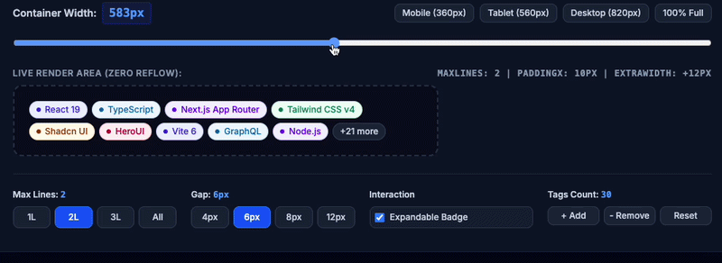

# 🏷️ tag-list-overflow

[](https://www.npmjs.com/package/tag-list-overflow)
[](https://bundlephobia.com/package/tag-list-overflow)
[](https://stackblitz.com/github/galaxytemple/tag-list-overflow)
[](./LICENSE)
[](https://www.typescriptlang.org/)

> **High-performance, responsive React tag & chip list component** with dynamic line-clamping (`maxLines`) and a customizable `+N more` overflow badge. Predicts layout off-DOM using Canvas 2D text metrics to eliminate post-render DOM reflows and jarring layout shifts.

<p align="center">
  
</p>

<p align="center">
  <a href="https://stackblitz.com/github/galaxytemple/tag-list-overflow" target="_blank" rel="noopener noreferrer">
    
  </a>
</p>

---

## ⚡ Quick Demo

```tsx
import { TagListOverflow } from "tag-list-overflow";

export function Example() {
  const tags = ["React", "TypeScript", "Next.js", "Tailwind CSS", "Vite", "GraphQL", "Zustand"];

  return (
    <TagListOverflow
      items={tags}
      maxLines={1}
      gapX={6}
      gapY={4}
      expandable
      overflowLabel={(count) => `+${count} more`}
    />
  );
}
```

---

## 🔍 Why `tag-list-overflow`?

### The Limitations of Existing Approaches
1. **CSS `line-clamp` does not work on flex tags**: CSS `-webkit-line-clamp` only truncates uniform multi-line text blocks. It cannot clamp `flex-wrap` rows, nor can it dynamically compute and reserve pixel space for a `+N more` overflow counter on the final row.
2. **Traditional DOM libraries cause jarring Layout Shifts (High CLS)**:
   Traditional tag overflow libraries rely on a 2-pass DOM measuring cycle:
   - **Pass 1**: Mount *all* tags into the DOM.
   - **Pass 2**: In `useEffect` / `useLayoutEffect`, query `getBoundingClientRect()` or `offsetTop` across elements (forcing browser reflows), calculate which tags overflow, and unmount them.
   - **The Result**: Surrounding content jumps upward after initial paint, causing visible layout shifts and UI flickering.

### The Solution: Off-DOM Canvas Layout Prediction
`tag-list-overflow` pre-computes tag dimensions **off-DOM** using HTML5 Canvas 2D text metrics and a multi-pass greedy packing algorithm:
- **Zero DOM-Read Reflows**: Tag widths are measured in-memory once. Resizing recomputes line allocations via pure math in `< 0.1ms` without querying DOM element geometries.
- **Visual Stability**: Pre-reserves the exact pixel width required for the `+N more` badge on the final row, preventing badges from wrapping to unintended rows.
- **60fps Fluid Resizing**: Container changes are tracked via `ResizeObserver` with content-box normalization and `requestAnimationFrame` throttling.
- **SSR & Next.js App Router Compatible**: Ready with `"use client";`. Supply `containerWidth` for 1-pass layout calculation matching server-rendered containers.
- **Zero Runtime Dependencies**: Pure TypeScript (< 3kB min+gzip).

> [!NOTE]
> **Layout Modes & SSR**:
> - **Fixed / Known Width (Instant 1-Pass)**: Pass `containerWidth` (e.g. `containerWidth={600}`) to pre-compute layout immediately without DOM observation.
> - **Responsive Width (Automatic)**: When `containerWidth` is omitted, the component measures the container content width on mount via `ResizeObserver` with safety height clamping to avoid visual jumping.
> - **Web Fonts**: When using custom web fonts, `@font-face` is automatically supported; the library listens to `document.fonts.ready` to refresh cached widths once fonts finish downloading.

### 📊 Feature Comparison

| Feature | CSS `line-clamp` | Traditional DOM Libraries | `tag-list-overflow` |
| :--- | :---: | :---: | :---: |
| **Flex-Wrap Tag Lists** | ❌ Text-only | ⚠️ Post-mount DOM reads | ✅ **Off-DOM Canvas prediction** |
| **Dynamic `+N more` Badge** | ❌ Not supported | ⚠️ Prone to row-wrap shifts | ✅ **Exact space pre-reserved** |
| **Layout Shifts (CLS)** | 0 | ❌ High (height collapse jumps) | ✅ **Minimized / 0 with `containerWidth`** |
| **Resize Computation** | Native | ❌ Slow (reads DOM every frame) | ✅ **< 0.1ms (Pure math array)** |
| **Next.js App Router (RSC)** | ✅ | ⚠️ Hydration mismatches | ✅ **`"use client";` compatible** |
| **Runtime Dependencies** | 0 | Often heavy | ✅ **0 dependencies** |

---

## 📦 Installation

```bash
# npm
npm install tag-list-overflow

# pnpm
pnpm add tag-list-overflow

# yarn
yarn add tag-list-overflow

# bun
bun add tag-list-overflow
```

> **Peer Dependency**: React `>= 18.0.0`

---

## 🚀 Features & Usage Examples

### 1. Simple String Tags (Zero-Config)
```tsx
<TagListOverflow
  items={["JavaScript", "TypeScript", "Python", "Rust", "Go", "C++"]}
  maxLines={1}
  gapX={8}
/>
```

### 2. Custom Tag Components (via `children` render-prop or `renderTag`)
You can inject your own design system tags, chips, or Tailwind components:

```tsx
<TagListOverflow items={categories} maxLines={2} gapX={6} gapY={6}>
  {(category) => (
    <span className="inline-flex items-center px-2.5 py-0.5 rounded-full text-xs font-medium bg-blue-100 text-blue-800">
      {category.name}
    </span>
  )}
</TagListOverflow>
```

### 3. Design System Integration (Shadcn UI, HeroUI, Tailwind CSS)

To ensure accurate off-DOM layout prediction with custom tags from Shadcn UI, HeroUI, or Tailwind CSS, configure top-level metric props (`paddingX`, `fontSize`, `fontWeight`, `extraWidth`) to match your CSS classes:

```tsx
import { TagListOverflow } from "tag-list-overflow";
import { Badge } from "@/components/ui/badge";

<TagListOverflow
  items={tags}
  maxLines={1}
  gapX={6}
  gapY={6}
  paddingX={10}    // matches px-2.5 (10px)
  fontSize={12}    // matches text-xs (12px)
  fontWeight={600} // matches font-semibold (600)
  extraWidth={16}  // accounts for optional leading icon, dot, or avatar
  expandable
  overflowLabel={(count) => `+${count} more`}
  renderTag={(tag) => (
    <Badge role="listitem" variant="secondary">
      {tag}
    </Badge>
  )}
/>
```

> **Accessibility Tip**: When using custom tag renderers with the default `role="list"` container, add `role="listitem"` to your tag element for full W3C ARIA compliance.

### 4. Custom Overflow Badge & Click-to-Expand
Enable `expandable` to let users click `+N more` to expand all tags, or provide a custom button:

```tsx
<TagListOverflow
  items={skills}
  maxLines={1}
  gapX={6}
  expandable
  renderOverflow={({ count, toggle, isExpanded }) => (
    <button
      onClick={toggle}
      className="px-2 py-0.5 text-xs font-semibold rounded-full bg-indigo-50 text-indigo-600 hover:bg-indigo-100 transition"
    >
      {isExpanded ? "Show less ↑" : `+${count} more ↓`}
    </button>
  )}
/>
```

### 5. Internationalization & Custom Labels
Format the overflow text as a string or function:

```tsx
// Custom formatter function
<TagListOverflow
  items={tags}
  overflowLabel={(count) => `and ${count} others`}
  collapseLabel="Collapse"
  expandable
/>
```

### 6. Partial / Paginated Server Data (`totalCount`, `isLoading`, `loadingComponent`)
When tags are paginated or fetched asynchronously from a database:
- `totalCount`: Displays the true remaining count on the badge (e.g. `+147 more` instead of just loaded tags).
- `isLoading` & `loadingComponent`: Renders an inline indicator next to the badge.
- `loadingWidth`: Reserves pixel space for the loading indicator on the final row, ensuring it does not wrap or get clipped. If omitted, it is automatically measured from the rendered component (with instant Canvas text fallback).

```tsx
import { useState } from "react";
import { TagListOverflow } from "tag-list-overflow";

function PaginatedTagsExample() {
  const [tags, setTags] = useState(["React", "TypeScript", "Tailwind"]);
  const [isLoading, setIsLoading] = useState(false);

  const handleExpandedChange = async (expanded: boolean) => {
    if (expanded && tags.length < 150) {
      setIsLoading(true);
      const newTags = await fetchNextPageTags();
      setTags((prev) => [...prev, ...newTags]);
      setIsLoading(false);
    }
  };

  return (
    <TagListOverflow
      items={tags}
      totalCount={150} // Displays "+147 more"
      maxLines={1}
      expandable
      isLoading={isLoading}
      loadingWidth={28}
      loadingComponent={
        <span className="inline-flex items-center gap-1 text-xs text-indigo-500 animate-pulse">
          <svg className="w-3.5 h-3.5 animate-spin" viewBox="0 0 24 24" fill="none">
            <circle className="opacity-25" cx="12" cy="12" r="10" stroke="currentColor" strokeWidth="4" />
            <path className="opacity-75" fill="currentColor" d="M4 12a8 8 0 018-8v8H4z" />
          </svg>
        </span>
      }
      onExpandedChange={handleExpandedChange}
    />
  );
}
```

### 7. Independent Horizontal (`gapX`) & Vertical (`gapY`) Spacing
```tsx
<TagListOverflow
  items={tags}
  maxLines={3}
  gapX={12} // columnGap: horizontal space between tags in the same row
  gapY={8}  // rowGap: vertical space between wrapped lines
/>
```

### 8. Headless Hook (`useTagOverflow`)
For maximum control over markup, animations (Framer Motion), or virtualized lists, use the headless hook directly:

```tsx
import { useTagOverflow } from "tag-list-overflow";

function CustomTagBar({ tags }) {
  const {
    containerRef,
    visibleItems,
    remainingCount,
    isExpanded,
    toggle,
  } = useTagOverflow({
    items: tags,
    maxLines: 1,
    gapX: 8,
    expandable: true,
  });

  return (
    <div ref={containerRef} className="flex flex-wrap gap-2">
      {visibleItems.map((tag) => (
        <span key={tag} className="tag">{tag}</span>
      ))}
      {remainingCount > 0 && (
        <button onClick={toggle}>+{remainingCount} more</button>
      )}
    </div>
  );
}
```

---

## 📖 Component Props API (`TagListOverflowProps`)

| Prop | Type | Default | Description |
| :--- | :--- | :--- | :--- |
| `items` | `readonly T[]` | **Required** | Array of items/tags to render. |
| `maxLines` | `number` | `1` | Maximum rows to display. If `<= 0`, shows all tags without clamping. |
| `gap` | `number` | `undefined` | Shorthand setting both `gapX` and `gapY`. |
| `gapX` | `number` | `gap ?? 4` | Horizontal gap (`columnGap`) in pixels between tags. Used for line-packing. |
| `gapY` | `number` | `gap ?? 4` | Vertical gap (`rowGap`) in pixels between rows when `maxLines > 1`. |
| `containerWidth` | `number` | `undefined` | Fixed container width in px. Bypasses ResizeObserver for 1-pass SSR or testing. |
| `children` | `(item: T, index: number) => ReactNode` | `undefined` | Render prop function for custom tags. |
| `renderTag` | `(item: T, index: number) => ReactNode` | `undefined` | Alternative prop for custom tag renderer. |
| `renderOverflow` | `(info: OverflowInfo<T>) => ReactNode` | `undefined` | Custom renderer for the `+N more` overflow indicator. |
| `overflowLabel` | `string \| ((count: number) => ReactNode)` | `"more"` | Suffix or formatter function for the overflow badge text. |
| `collapseLabel` | `string \| (() => ReactNode)` | `"Show less"` | Label displayed when expanded. |
| `expandable` | `boolean` | `false` | Whether clicking the overflow badge toggles expansion. |
| `expanded` | `boolean` | `undefined` | Controlled expansion state. |
| `onExpandedChange` | `(expanded: boolean) => void` | `undefined` | Callback fired when expansion state changes. |
| `tagSize` | `'sm' \| 'md' \| 'lg' \| TagMetricsConfig` | `'md'` | Sizing preset or custom metrics for font, padding, and border. |
| `paddingX` | `number` | `8` | Horizontal padding per side in px. Applied to default tags and layout calculation. |
| `extraWidth` | `number` | `0` | Extra width buffer in px for icons, avatars, dots, or close buttons. |
| `fontSize` | `number` | `14` | Font size in px. Applied to default tags and layout calculation. |
| `fontWeight` | `number \| string` | `400` | Font weight (e.g. `500`, `'bold'`). |
| `fontFamily` | `string` | `Auto` | Font family stack. Auto-detected from container if omitted. |
| `border` | `number` | `1` | Border width per side in px. |
| `overflowPaddingX` | `number` | `paddingX` | Horizontal padding per side for the `+N more` badge. |
| `overflowExtraWidth` | `number` | `0` | Extra width buffer for the `+N more` badge (e.g. arrow icons). |
| `getItemLabel` | `(item: T) => string` | `Auto` | Extracts label for measurement. Auto-resolves `.label`, `.name`, `.title`, `.value`. |
| `getItemKey` | `(item: T, index: number) => Key` | `Auto` | Extracts React key. Defaults to `item.id ?? item.key ?? item ?? index`. |
| `getItemWidth` | `(item: T, index: number, ctx: CanvasRenderingContext2D) => number` | `undefined` | Optional override for calculating individual item widths. |
| `totalCount` | `number` | `undefined` | Total count for server-paginated data. |
| `isLoading` | `boolean` | `false` | Whether tags are actively being fetched or paginated. |
| `loadingComponent` | `ReactNode \| (() => ReactNode)` | `undefined` | Element rendered next to the badge during loading. |
| `loadingWidth` | `number` | `Auto` | Reserved layout width in px for `loadingComponent` on the final line. Automatically measured if omitted. |
| `renderSkeleton` | `() => ReactNode` | `undefined` | Custom skeleton renderer during initial loading. |
| `tagHeight` | `number` | `undefined` | Explicit row height in px for container height clamping. Auto-detected if omitted. |
| `role` | `string` | `"list"` | ARIA role applied to container. If set to `"list"`, custom tags should include `role="listitem"`. |
| `className` | `string` | `undefined` | Class name applied to the container `div`. |
| `style` | `CSSProperties` | `undefined` | Inline styles applied to the container `div`. |
| `tagClassName` | `string` | `undefined` | Class name applied to default tags. |

### 📐 Tailwind CSS Metric Quick-Reference

When integrating custom badges with Tailwind CSS, use this quick conversion table for accurate layout prediction:

| Tailwind Class | TagListOverflow Prop | Value |
| :--- | :--- | :--- |
| `px-2` | `paddingX` | `8` |
| `px-2.5` *(Shadcn default)* | `paddingX` | `10` |
| `px-3` | `paddingX` | `12` |
| `text-xs` | `fontSize` | `12` |
| `text-sm` | `fontSize` | `14` |
| `font-medium` | `fontWeight` | `500` |
| `font-semibold` *(Shadcn default)* | `fontWeight` | `600` |
| Leading dot / 16px Lucide icon | `extraWidth` | `14` ~ `18` |

### `OverflowInfo<T>` Object
Passed to `renderOverflow`:
```typescript
interface OverflowInfo<T> {
  count: number;             // Number of hidden items
  overflowItems: T[];        // Array of hidden items
  visibleItems: T[];         // Array of visible items
  isExpanded: boolean;       // Expansion state
  expand: () => void;        // Expand handler
  collapse: () => void;      // Collapse handler
  toggle: () => void;        // Toggle handler
  isLoading?: boolean;       // Loading state
}
```

---

## 🎨 Local Playground

An interactive Vite demo playground is included in the repository:

```bash
pnpm dev
# Opens http://localhost:3000 with real-time responsive sliders and controls
```

---

## 💡 Acknowledgements

Inspired by the off-DOM mathematical layout concepts demonstrated by [Pretext](https://pretextjs.net) by [@chenglou](https://github.com/chenglou), bringing instant canvas text metrics and dynamic line packing to React tag and chip lists.

---

## 📄 License

MIT © 2026
